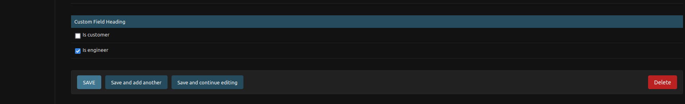

# Ticket system built with Django

- This project is built with Django with python version >= 3.8
- Also ensure you have docker and docker-compose installed

## Setup

Clone the repository:

```sh
$ git clone https://github.com/nassersaazi/ticketit.git
$ cd ticketit
```

Create a virtual environment to install dependencies in and activate it:

```sh
docker-compose up -d
```


Create a superuser with admin privileges in the application as follows

And navigate to `http://127.0.0.1:8000`. You will need to register an account first
for authorization purposes

### Some guidelines when creating a user

```
    Your password can’t be too similar to your other personal information.
    Your password must contain at least 8 characters.
    Your password can’t be a commonly used password.
    Your password can’t be entirely numeric.
```


## Walkthrough

During the interaction with the app. There are two user flows. You can register as a customer or as
an engineer. 


### Customer Flow

The simplest user role is 'customer'. Once the app is loaded you will be redirected to the account creation
page where you can create an account and login. 

Once logged in, you can create tickets, view the status of different tickets and even update tickets with 
relevant details

### Engineer Flow

The other user role is 'engineer'. To create a user with this role, navigate to `http://127.0.0.1:8000/admin`
Use these user details for the admin user:
```
username: saazi
password: saazi123
```
After logging in, navigate to the admin dashboard and create a new user with the engineer role as shown in the image below
 

You can now log in to the application with this new user. The engineer has access to other parts of the application such as a workspace where to monitor tickets he has been assigned, as well as ticket queue from where to pick up unassigned tickets


### Authorization

All parts of the system can only be accessed after logging in 


